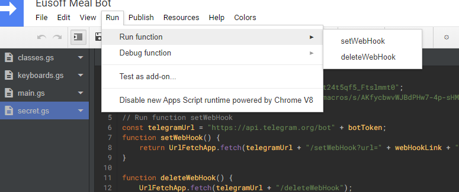
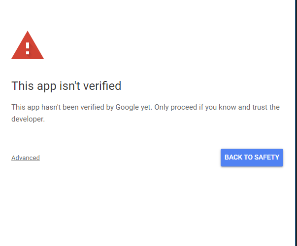
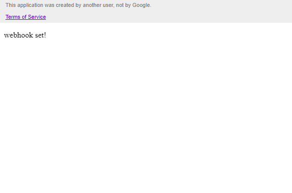
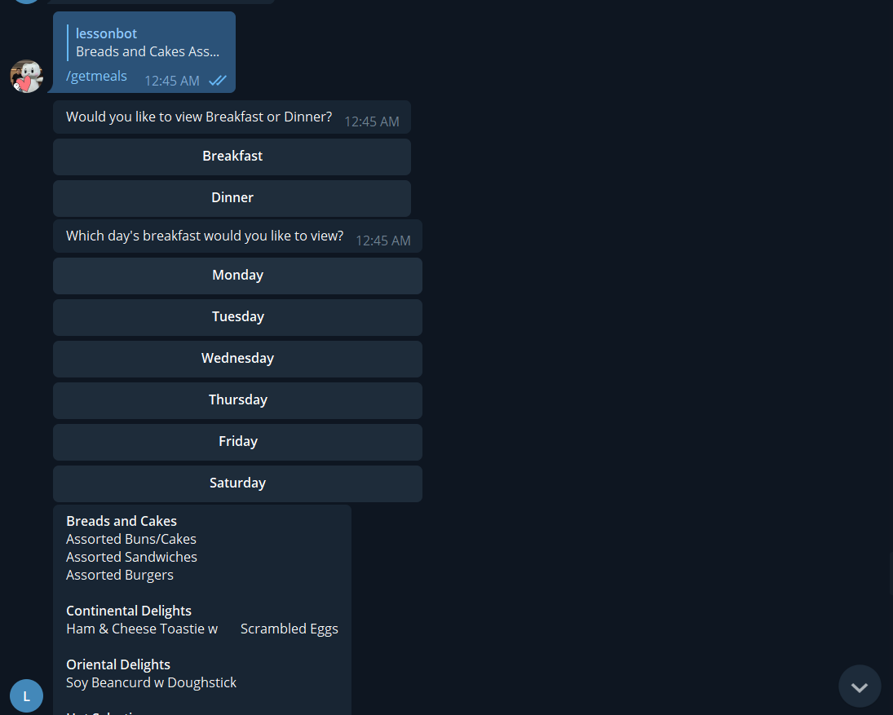

# Eusoff Meal Bot


**Eusoff Meal Bot** is a telegram bot that shows breakfast and dinner for Eusoff Hall for the current week.

It uses Google Apps Script as a webhook for the telegram bot.

Done by [@glennjs](https://github.com/glennljs)

## Requirements

To use this, you'll need.

1. [Telegram bot Token](https://core.telegram.org/bots)
2. [A google account](https://script.google.com/home)
3. [Spreadsheet IDs](https://developers.google.com/sheets/api/guides/concepts#spreadsheet_id) to the breakfast and dinner menus in google sheet format (upload [files from this folder](menu) to google drive and convert to google sheets files through `File > Save as Google Sheets`)

## Installation

1. With [npm](https://github.com/nodenv/nodenv) installed, install [clasp](https://developers.google.com/apps-script/guides/clasp) globally

   ```bash
   npm install -g @google/clasp
   ```

2. Run `yarn` to install dependencies
3. Enable the [Google Apps Script API](https://script.google.com/home/usersettings)
4. Then login to Google, `clasp login`
5. Create the google app, `clasp create --title "Eusoff Meal Bot" --type webapp --rootDir ./src`
6. Add the file order from `.clasp.json.example` into `.clasp.json`.
7. Copy `secret.js.example` into `secret.js`, replace all placeholder values with your own, except for deployment id.
8. Deploy it using `clasp deploy` to get the deployment id.

   Take note of the deployment id after `Created version x`

   ```
   Created version 1.
   - <<YOUR DEPLOYMENT ID HERE>> @1.
   ```

9. Now set the deployment id in `secret.js` along with the bot token and sheet ids.
10. Run `clasp push` and `clasp deploy -i <<YOUR DEPLOYMENT ID HERE>>` to push your code to Google Scripts and deploy it again
11. Run `clasp open` to open it in google script
12. Click `secret.js`, and click `Run > Run Function > setWebHook`

    Like so

    

13. It will ask you to authorise (for the first time), and it should be ok to do so, click `Advanced > Go to Eusoff Meal Bot (unsafe) > Allow`

    

14. Open the app by `clasp open --webapp`, select the version with your deployment id to open. (This will automatically reset the telegram bot's webhooks)

    This should be seen.

    

15. Open your telegram bot! It should show you the breakfast and dinner for the current week!

    

## Tips

- When you want to update your telegram bot with the current code, use `clasp push && clasp deploy -i <<YOUR DEPLOYMENT ID>>`
